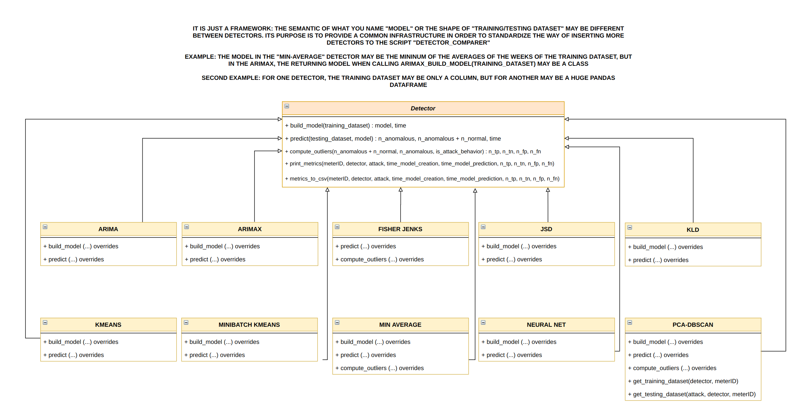
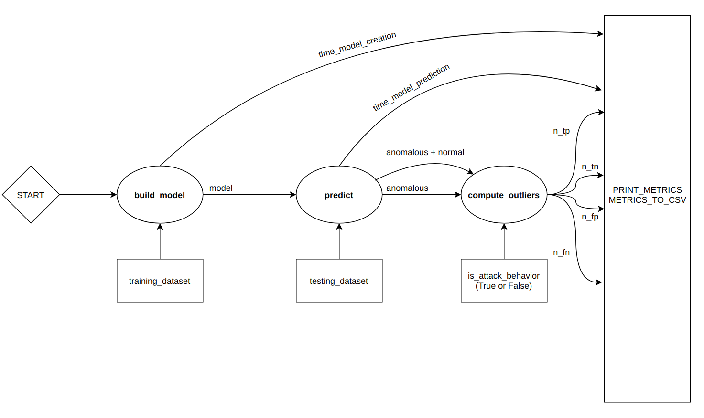

# How to add and test a new detector

1. Create a class that encapsulates your detector in the directory src/detectors/. This class must inherit from the abstract class Detector defined in this directory and needs to override its abstract methods "build_model" and "predict".
    ```
    from .Detector import Detector

    class MyCustomDetector(Detector):
    
        def build_model(self, training_dataset):
            t0 = time()
            # Use the training dataset
            return model, time() - t0 
    
        def predict(self, testing_dataset, model):
            t0 = time()
            # Use the testing dataset and the model
            return number_of_anomalous, number_of_anomalous + number_of_normal, time() - t0
    ```
    
    Note that there are another five methods ("compute_outliers", "print_metrics", "metrics_to_csv", "get_training_dataset" and "get_testing_dataset") declared and implemented in Detector (they are not abstract methods). You can override any of them in your detector class if you need it, but respect the semantics and the inputs/outputs, or it will crash later! 
    You can see some examples:
    - src/detectors/PCADBSCAN.py: I needed to modify the training/testing dataset.
    - src/detectors/MinAverage.py: I needed to modify the compute_outliers because I return my predictions in a dict instead in a numerical value.
    
    However, I recommend only overriding "build_model" and "predict" methods if you start designing your class using this schema.

2. Create a new "elif" branch in the static method DetectorFactory.create_detector
   ````
    class DetectorFactory:
   
    @staticmethod
    def create_detector(detector):
        if detector == "Min-Avg":
            return MinAverage()
        elif detector == "JSD":
            return JSD()
        elif detector == "MyCustomDetectorName":
            return MyCustomDetector()
        else:
            raise KeyError("Detector " + detector + " not found. You must add a conditional branch in /src/detectors/DetectorFactory.py")
    ````
   
   Don't forget to import the module you've just created in the step 1!
   ````
   from .MyCustomDetector import MyCustomDetector
   ````

3. Add the name that you've indicated in the DetectorFactory.create_detector elif branch to the list named "list_of_detectors" in the file detector_comparer
   ````
   list_of_detectors = ["MyCustomDetectorName", ..., "ARIMA", "ARIMAX", "JSD", "KLD", "Min-Avg"]
   ````
   
4. And run...
   ````
   export PYTHONPATH=.
   python3 src/experiments/detector_comparer.py <type_of_dataset>
   ````
   
## Extra: understanding the proposal and the architecture






